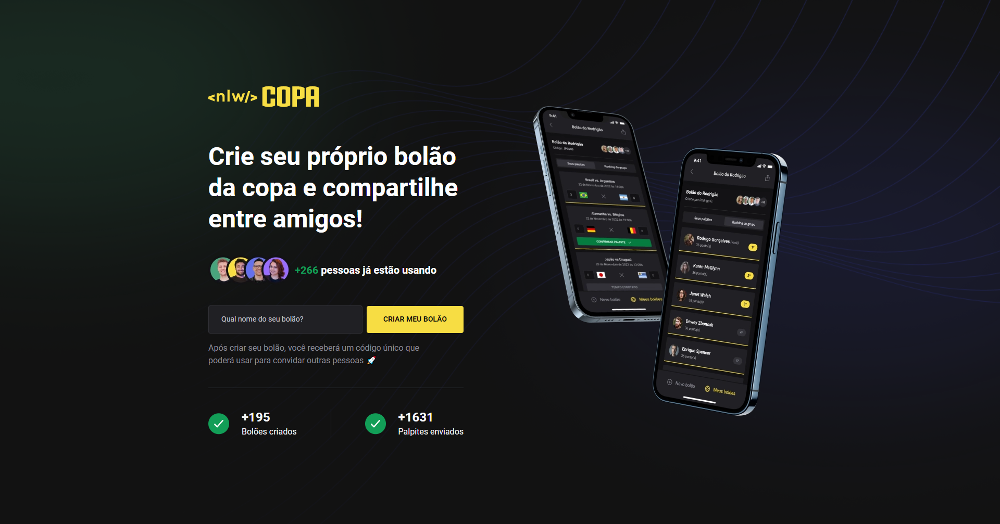

<h1 align="center">Web</h1>

  

<!--  -->
</img>

 

## 💻 Projeto

A versão web e uma landing page que inicia o usuário no sistema e mostra algumas informações gerais sobre o COPA 

## ✨ Tecnologias

Esse projeto foi desenvolvido com as seguintes tecnologias:
- [React](https://reactjs.org/)
- [Next](https://nextjs.org/)
- [Axios](https://axios-http.com/)
- [Eslint](https://eslint.org/)
- [Critters](https://github.com/GoogleChromeLabs/critters)
- [TypeScript](https://www.typescriptlang.org/)
- [Tailwindcss](https://tailwindcss.com/)

## 🚀 Como executar
- Clone o repositório [web]( ./) e [server](../server)
>Web
- Rode `cd web` para ir até a pasta da Web Page
- Rode `npm install` para instalar as dependências
- Execute a [Server](../server#-como-executar) e conecte-se
- Rode o `npm run dev` para iniciar a aplicação na porta <b>3000</b>
- Por fim, o <b>Website</b> estará disponível em `http://localhost:3000`

## 📄 Licença

Esse projeto está sob a licença MIT. Veja o arquivo [LICENSE](../LICENSE) para mais detalhes.
